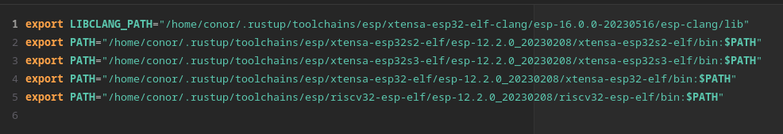
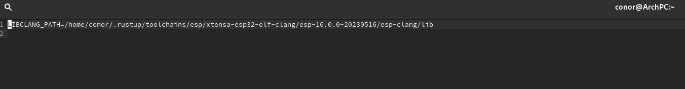
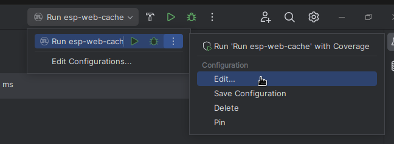
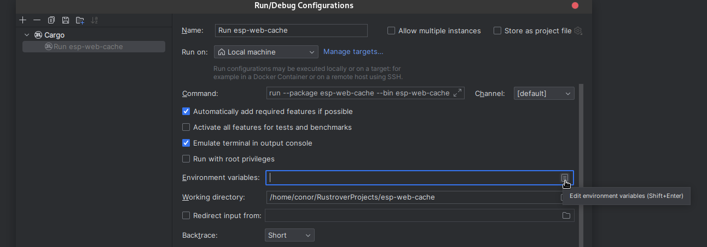
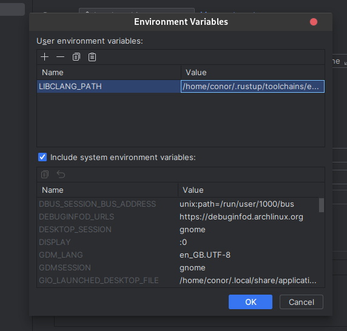

# Setup
To initially get setup from zero, I followed [The Rust on ESP Book](https://esp-rs.github.io/book/) which got me 99% of the way there. I encountered one issue when running it inside of the new RustRover IDE. The below solutions assume you have followed the guide as well so as to generate a `export-esp.sh` file.

When choosing between "RISC-V Targets Only" and "RISC-V and Xtensa targets", you will want to pick the one with Xtensa targets for ESP32s I believe, especially in the case of the UDOO Key. When choosing the board type for the ESP32 in setting up the project, it appears the UDOO Key is just a standard `esp32` board, without any of the other letters offered.
# Issues I encountered

## Unknown Target Triple 'xtensa'
When building for the ESP32 via RustRover's Inbuilt Run Feature (pictured below)  
I encountered the following error when building `esp-idf-sys` 
```bash
Built components: esp_ringbuf, efuse, esp_ipc, driver, esp_pm, mbedtls, bootloader, esptool_py, partition_table, app_update, bootloader_support, spi_flash, nvs_flash, pthread, esp_gdbstub, espcoredump, esp_phy, esp_system, esp_rom, hal, vfs, esp_eth, tcpip_adapter, esp_netif, esp_event, wpa_supplicant, esp_wifi, ieee802154, console, openthread, lwip, log, heap, soc, esp_hw_support, xtensa, esp32, esp_common, esp_timer, freertos, newlib, cxx, app_trace, asio, bt, cbor, unity, cmock, coap, nghttp, esp-tls, esp_adc_cal, esp_hid, tcp_transport, esp_http_client, esp_http_server, esp_https_ota, esp_https_server, esp_lcd, protobuf-c, protocomm, mdns, esp_local_ctrl, sdmmc, esp_serial_slave_link, esp_websocket_client, expat, wear_levelling, fatfs, freemodbus, idf_test, jsmn, json, libsodium, mqtt, openssl, perfmon, spiffs, usb, tinyusb, ulp, wifi_provisioning
  error: unknown target triple 'xtensa', please use -triple or -arch
  thread 'main' panicked at 'libclang error; possible causes include:
  - Invalid flag syntax
  - Unrecognized flags
  - Invalid flag arguments
  - File I/O errors
  - Host vs. target architecture mismatch
```
I found that the reason for this was that under Wayland, the `.bashrc` file (where The Rust on ESP Book suggests you save your environment variable exports) is not loaded by default in wayland. This meant when running it via the inbuilt Run feature it would not work, however when running it in the Inbuilt terminal it ran fine due to the fact the inbuilt terminal appears to read the `.bashrc` file.

### Solutions
#### Wayland
Copy the `LIBCLANG_PATH` from `~/export-esp.sh` 

and place it without quotes i.e. 
`LIBCLANG_PATH=/home/conor/.rustup/toolchains/esp/xtensa-esp32-elf-clang/esp-16.0.0-20230516/esp-clang/lib`
inside the file (Create it if it doesn't exist) 
`~/.config/environment.d/envvars.conf`

Restart your PC, and Voila! The run command should now work successfully.
#### All

You can edit environment variables for each individual configuration by clicking the above pictured "Edit..." button.

In here, click the button to edit your environment variables.

Then click `+` to add a new one and set the name to `LIBCLANG_PATH` and the value to the value inside `~/export-esp.sh` for `LIBCLANG_PATH` without the quotes, and that action should now run successfully.
