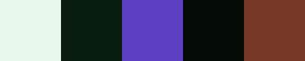

Generated using [Realtime Colors](../../../Pages/Omnivore/2023-05-16/Realtime%20Colors.md), a site that lets you preview these combinations as you generate them.

# Palette 1

Your selected colors:

    Primary: #e7dcef (RGB: 231, 220, 239)
    Secondary: #1b1023 (RGB: 27, 16, 35)
    Primary Button: #c5aa81 (RGB: 197, 170, 129)
    Secondary Button: #08050a (RGB: 8, 5, 10)
    Accent: #479a79 (RGB: 71, 154, 121)

Realtime Colors link for selected colors: https://realtimecolors.com/?colors=e7dcef-1b1023-c5aa81-08050a-479a79

# Palette 2

Your selected colors:

    Primary: #f5f5f5 (RGB: 245, 245, 245)
    Secondary: #171717 (RGB: 23, 23, 23)
    Primary Button: #b8b8b7 (RGB: 184, 184, 183)
    Secondary Button: #1f1e1f (RGB: 31, 30, 31)
    Accent: #838586 (RGB: 131, 133, 134)

Realtime Colors link for selected colors: https://realtimecolors.com/?colors=f5f5f5-171717-b8b8b7-1f1e1f-838586

# Palette 3

Your selected colors:

    Primary: #e8f8eb (RGB: 232, 248, 235)
    Secondary: #091b0d (RGB: 9, 27, 13)
    Primary Button: #5d41c3 (RGB: 93, 65, 195)
    Secondary Button: #040c05 (RGB: 4, 12, 5)
    Accent: #783826 (RGB: 120, 56, 38)

Realtime Colors link for selected colors: https://realtimecolors.com/?colors=e8f8eb-091b0d-5d41c3-040c05-783826

# Palette 4

Your selected colors:

    Primary: #f7f2f8 (RGB: 247, 242, 248)
    Secondary: #030203 (RGB: 3, 2, 3)
    Primary Button: #b0ad73 (RGB: 176, 173, 115)
    Secondary Button: #1a0f1a (RGB: 26, 15, 26)
    Accent: #73b0ad (RGB: 115, 176, 173)

Realtime Colors link for selected colors: https://realtimecolors.com/?colors=f7f2f8-030203-b0ad73-1a0f1a-73b0ad

# Palette 5

Your selected colors:

    Primary: #fdf9e7 (RGB: 253, 249, 231)
    Secondary: #0e0c01 (RGB: 14, 12, 1)
    Primary Button: #635408 (RGB: 99, 84, 8)
    Secondary Button: #2f2804 (RGB: 47, 40, 4)
    Accent: #7b680a (RGB: 123, 104, 10)

Realtime Colors link for selected colors: https://realtimecolors.com/?colors=fdf9e7-0e0c01-635408-2f2804-7b680a

# Palette 6

Your selected colors:

    Primary: #fdf7f9 (RGB: 253, 247, 249)
    Secondary: #200911 (RGB: 32, 9, 17)
    Primary Button: #c95745 (RGB: 201, 87, 69)
    Secondary Button: #040301 (RGB: 4, 3, 1)
    Accent: #826026 (RGB: 130, 96, 38)

Realtime Colors link for selected colors: https://realtimecolors.com/?colors=fdf7f9-200911-c95745-040301-826026

# Palette 7

Your selected colors:

    Primary: #f8fcf8 (RGB: 248, 252, 248)
    Secondary: #030703 (RGB: 3, 7, 3)
    Primary Button: #332c68 (RGB: 51, 44, 104)
    Secondary Button: #09160a (RGB: 9, 22, 10)
    Accent: #68332c (RGB: 104, 51, 44)

Realtime Colors link for selected colors: https://realtimecolors.com/?colors=f8fcf8-030703-332c68-09160a-68332c

# Palette 8

Your selected colors:

    Primary: #f5f4f5 (RGB: 245, 244, 245)
    Secondary: #19191a (RGB: 25, 25, 26)
    Primary Button: #95908e (RGB: 149, 144, 142)
    Secondary Button: #0a0a0b (RGB: 10, 10, 11)
    Accent: #5c615d (RGB: 92, 97, 93)

Realtime Colors link for selected colors: https://realtimecolors.com/?colors=f5f4f5-19191a-95908e-0a0a0b-5c615d

# Palette 9

Your selected colors:

    Primary: #f8edf7 (RGB: 248, 237, 247)
    Secondary: #1d0b1c (RGB: 29, 11, 28)
    Primary Button: #1d4920 (RGB: 29, 73, 32)
    Secondary Button: #281026 (RGB: 40, 16, 38)
    Accent: #000000 (RGB: 0, 0, 0)

Realtime Colors link for selected colors: https://realtimecolors.com/?colors=f8edf7-1d0b1c-1d4920-281026-000000

# Palette 10

Your selected colors:

    Primary: #f4f1f2 (RGB: 244, 241, 242)
    Secondary: #060405 (RGB: 6, 4, 5)
    Primary Button: #556d63 (RGB: 85, 109, 99)
    Secondary Button: #000000 (RGB: 0, 0, 0)
    Accent: #556d63 (RGB: 85, 109, 99)

Realtime Colors link for selected colors: https://realtimecolors.com/?colors=f4f1f2-060405-556d63-000000-556d63